# Speed Typing Test
(Developer: Ulrike Riemenschneider)

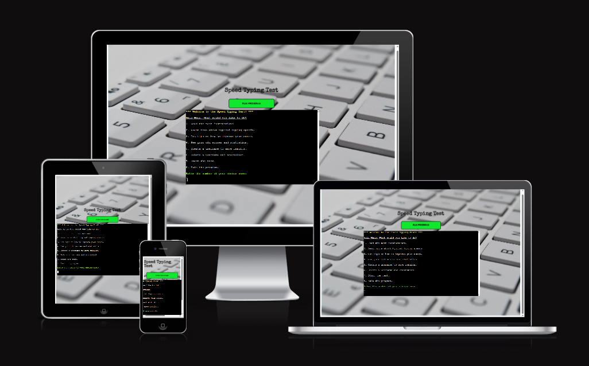

[Live webpage](https://speed-typing-test.herokuapp.com/)

## Table of Content

1. [Introduction](#introduction)
2. [Project Goals](#project-goals)
    1. [User Goals](#user-goals)
    2. [Site Owner Goals](#site-owner-goals)
3. [User Experience](#user-experience)
    1. [Strategy](#strategy)
        * [Target Audience](#target-audience)
        * [User Requirements & Expectations](#user-requirements-and-expectations)
        * [User Stories](#user-stories)
    2. [Scope](#scope)
        * [Initial Stage](#intial-stage)
        * [Future Additions](#future-additions)
    3. [Structure](#structure)
        * [Flowchart](#flowchart)
    4. [Surface](#surface)
        * [Color Scheme](#color-scheme)
    5. [Features](#features)
        * [Welcome Section](#welcome-section)
        * [Information Section](#information-sections)
        * [Test Section](#test-section)
        * [Results Section](#results-section)
        * [Future Additions](#future-additions)
4. [Technologies Used](#technologies-used)
    1. [Language](#languages)
    2. [Frameworks & Tools](#frameworks--tools)
    3. [Helpful Sites](#helpful-sites)
5. [Testing and Validation](#testing-and-validation)
    1. [Python Linter](#ci-python-linter)
    2. [HTML Validation](#html)
    3. [CSS Validation](#css)
    4. [Lighthouse Testing](#lighthouse)
    5. [User Stories](#user-stories)
    6. [Manual Testing](#manual-testing)
6. [Bugs & Fixes](#bugs--fixes)
7. [Deployment & Development](#deployment--development)
8. [Credits](#credits)

## Introduction

The Speed and Accuracy Typing tests is designed to give users a chance to test their abilities in terms of typing speed and accuracy. It also gives users the opportunity to access information on what constitues a good average score and how to improve. Users can create a score sheet to save their results, they can access past data and calculate averages. The can also delete their score sheet. The program is designed in Python and is run through a terminal window.

## Project Goals

### User Goals
- The site's user wants to test their typing skills in terms of speed and accuracy.
- The user can save results and track their progress.

### Site Owner Goals
- The site owner's goal is to provided an intuitive and easy to use application that allows a user to test their typing skills.
- The owner's goal is to encourage the user to return to the test in the future to retest their skill and review previous results.

## User Experience

### Strategy

#### Target Audience
- Users interested in testing and monitoring their typing skills.
- Users entering a field of work where typing is important and who are trying to improve this skill.

#### User Requirements and Expectations
- Simple and intuitive navigation system.
- Clear instructions and process flow.
- Immediate feedback on results.

#### User Stories

##### First-time User
As a first time user, I want to ...
1. ... read instructions.
2. ... easily and intuitively move through the test.
3. ... get easily understandable results.
4. ... understand how my score fits in with standard averages.
3. ... learn how I can improve my score.

##### Returning Users
As a returning user, I want to ...
1. ... retake the test to see if my score has improved.
2. ... access previous results.

##### Site owner
As the site owner, I want to ...
1. ... develop an application that is easy to use.
2. ... provide clear instructions of the application.
3. ... provide the user with additional information on how to improve.
4. ... provide the user with background information.
5. ... allow the user to save their scores and return to retest and improve their scores.

### Scope

#### Intial Stage

At the initial stage the application will include a main menu where the user can choose from a few option for further information, such as instructions, information on average typing speeds, informationn on how to improve their typing skills. The user can also opt to create a username and score sheet to record results, they can review old results and delete a previously created and populated score sheet. Then the user will be able to run the test and see immediate feedback in the form of a typing speed in characters/mintues and words/minute as well as a percentage accuracy. 

#### Future Additions

In a future edition of the application the user will be able to access ChatGPT to create custom text to type.

### Structure

#### Flowchart

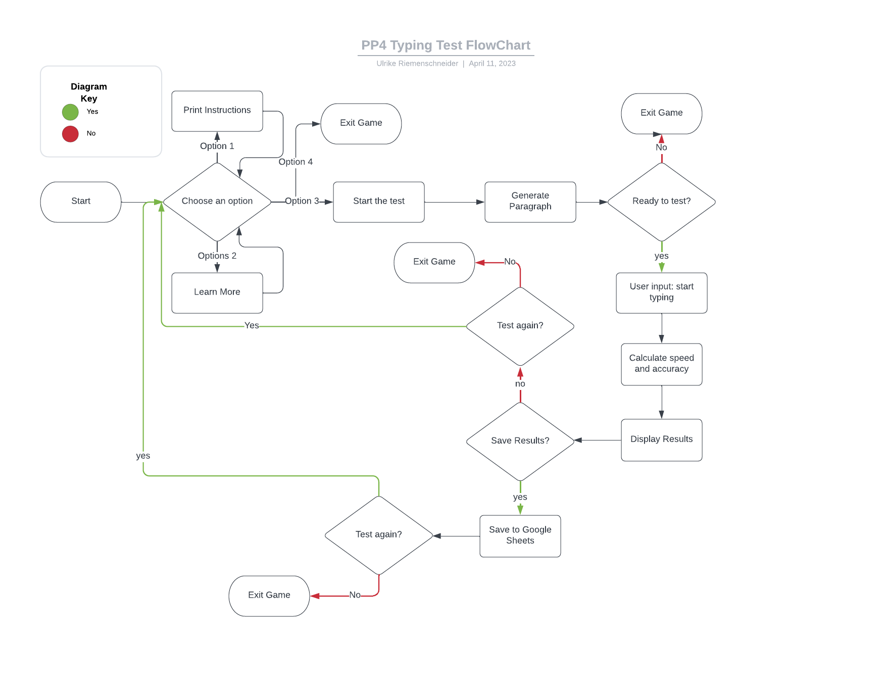

### Surface

#### Color Scheme

### Features

#### Main Menu

- A welcome message is displayed and the user can choose from a main menu of 8 option how to proceed.

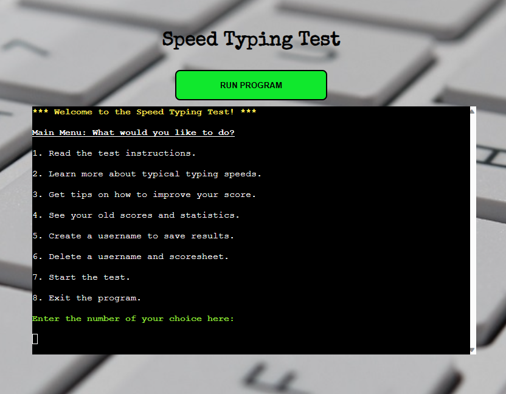

#### Information Sections

- Instructions: Here the user can read the instructions for the test.

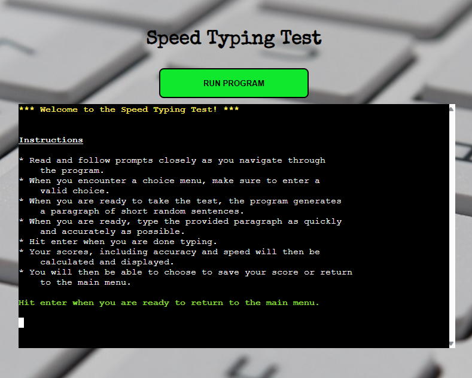

- General Information: Here the user can optain information on typical typing speeds and the world record in speed typing.

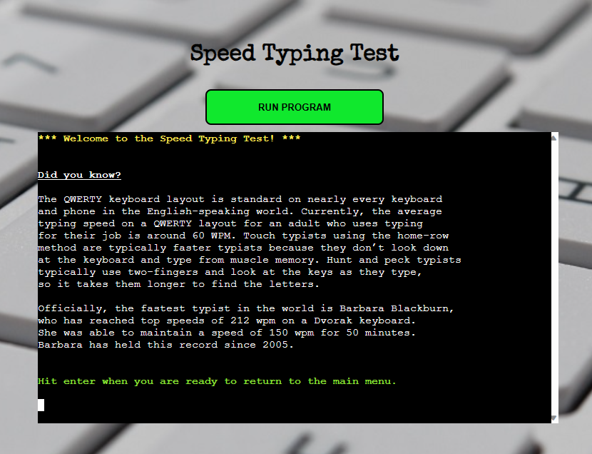

- How to improve: Here the user can get a few pointers on how to improve accuracy and speed of typing.

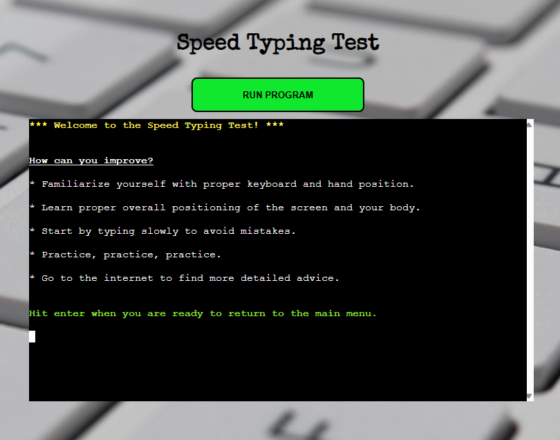

#### Score Sheet Sections

- Access past scores: Here the user can access a previously saved scoresheet and see individual results and averages. 

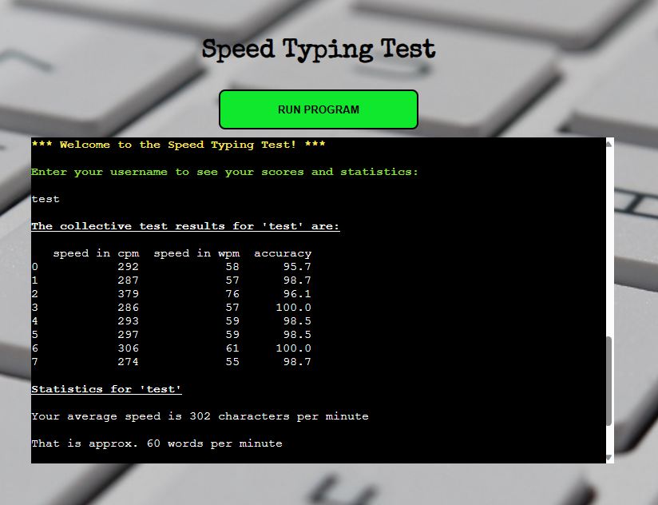

- Create a scoresheet: Here the user can enter a username and create a scoresheet.

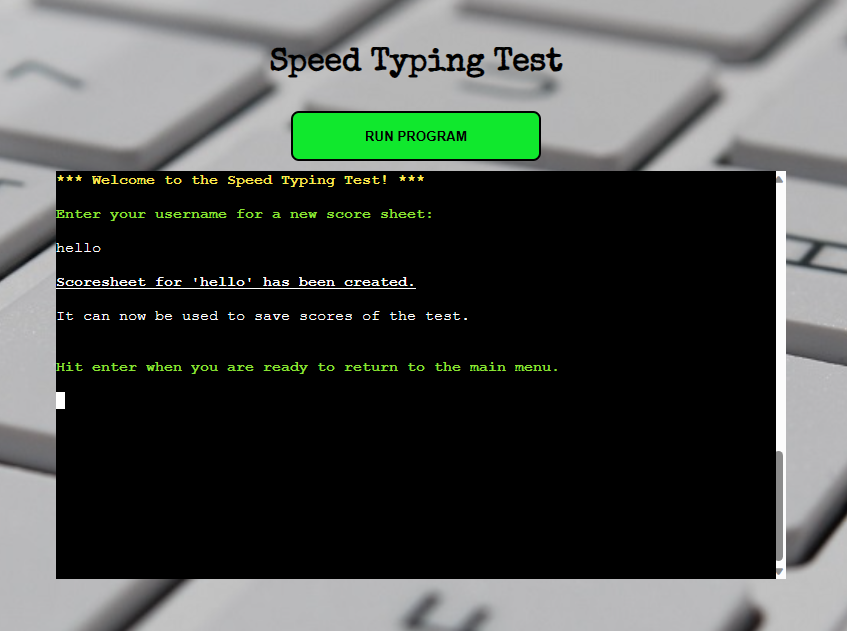

- Delete a scoresheet: Here the user can enter a username and delete a scoresheet with that name if it exists.

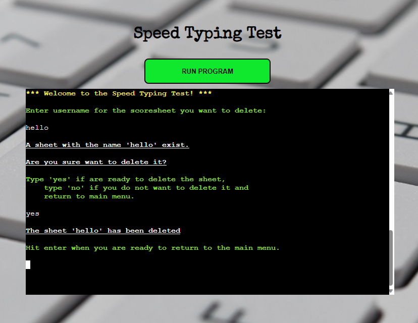

#### Testing Section

- Here the test is run. The user will be prompted to hit enter while moving through several steps until he/she is prompted to start typing and hit enter to complete the test.

- The score is then displayed. Accuracy is given as a percentage. Speed is displayed in characters per minute and words per minute.

- The user can then choose to exit the test, save the scores or test again.

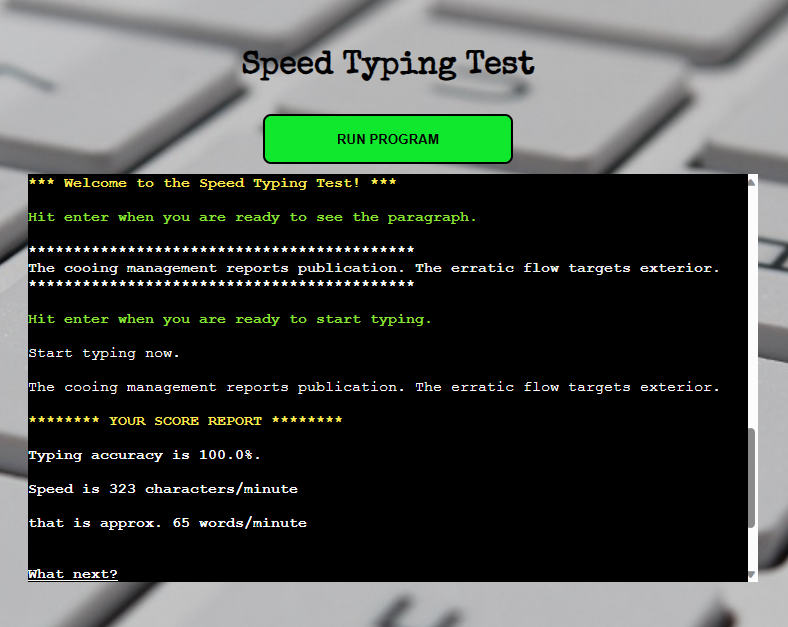

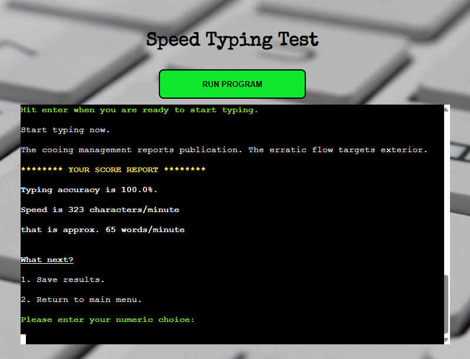

#### Exit Test

- The final choice in the main  menu is for the user to exit the program.

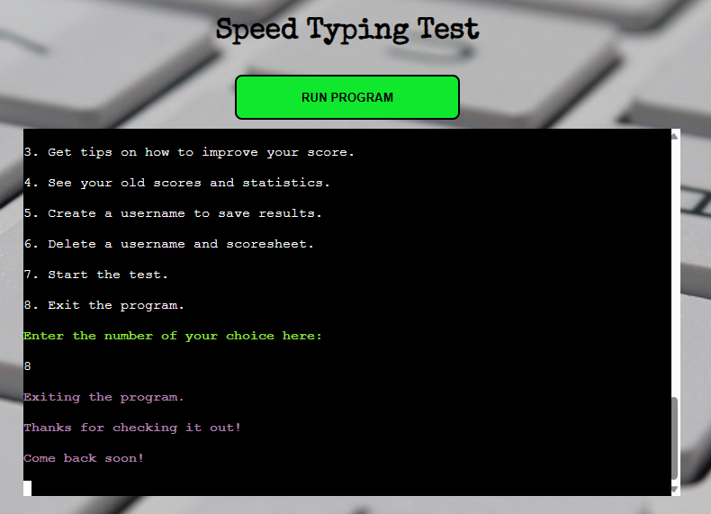

#### Future Additions

At this time the paragraph of random sentences created using 'wonderwords' is fairly nonsensical. In the future the developer would like to implement a simply routine that allows the user to request a short paragraph of text using ChatGPT on a topic of their choice. 

Because the only purpose of the paragraph is to test speed and accuracy of typing, the developer does not feel that it detracts from the purpose of the test to have meaningless text as the current test material. 

## Technologies Used

### Languages
- Python

#### Python Libraries
- Time
- OS
- Difflib
- Statistics
- Ast
- Gspread
- Wonderwords
- Termcolor
- Pandas

### Frameworks & Tools
- Git
- GitHub
- Gitpod
- Heroku
- Google Spreadsheets
- Lucidchart
- CI Python Linter
- W3C HTML and CSS Validation Service

### Helpful sites

Several sites came in handy while developing the code to help with problem solving:

- [W3 Schools](https://www.w3schools.com/)
- [Stack Overflow](https://stackoverflow.com)
- [mdn web docs](https://developer.mozilla.org/)
- [Geekflare](https://geekflare.com/python-remove-last-character/)

## Testing and Validation

### PEP8 CI Python Linter

- No errors found when testing the python code from run.py in the PEP8 CI Python Linter.

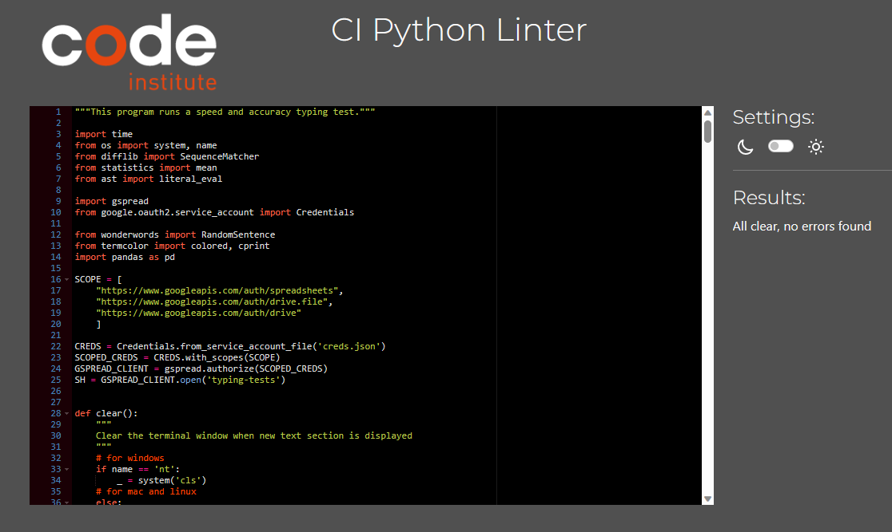

### HTML

- No errors or warnings found during HTML validation using W3C Markup Validation Service.

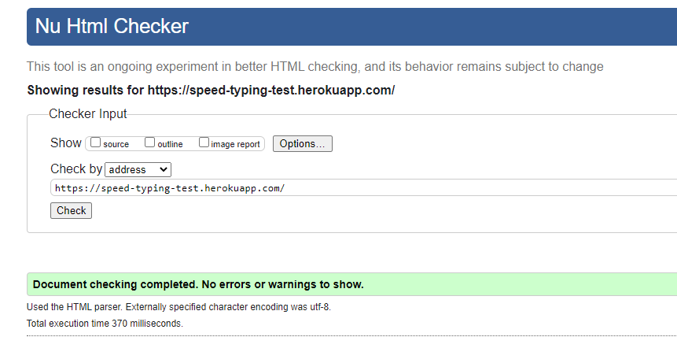

### CSS

- No errors found when validating the CSS using the W3C CSS Validation Service.

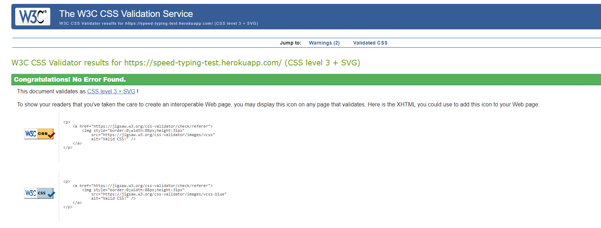

### Lighthouse

- Excellent scores for Performance, Accessiblity and Best Practises in Lighthouse.

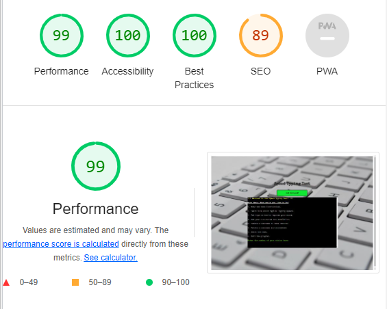

### Testing User Stories

As a first time user, I want to ...
1. ... read instructions.

| **Feature** | **Action** | **Expected Result** | **Actual Result** |
|-------------|------------|---------------------|-------------------|

2. ... easily and intuitively move through the test.

| **Feature** | **Action** | **Expected Result** | **Actual Result** |
|-------------|------------|---------------------|-------------------|

3. ... get easily understandable results.

| **Feature** | **Action** | **Expected Result** | **Actual Result** |
|-------------|------------|---------------------|-------------------|

4. ... understand how my score fits in with standard averages.

| **Feature** | **Action** | **Expected Result** | **Actual Result** |
|-------------|------------|---------------------|-------------------|

3. ... learn how I can improve my score.

| **Feature** | **Action** | **Expected Result** | **Actual Result** |
|-------------|------------|---------------------|-------------------|

As a returning user, I want to ...
1. ... retake the test to see if my score has improved.

| **Feature** | **Action** | **Expected Result** | **Actual Result** |
|-------------|------------|---------------------|-------------------|

2. ... access previous results.

| **Feature** | **Action** | **Expected Result** | **Actual Result** |
|-------------|------------|---------------------|-------------------|

As the site owner, I want to ...
1. ... develop an application that is easy to use.

| **Feature** | **Action** | **Expected Result** | **Actual Result** |
|-------------|------------|---------------------|-------------------|

2. ... provide clear instructions of the application.

| **Feature** | **Action** | **Expected Result** | **Actual Result** |
|-------------|------------|---------------------|-------------------|

3. ... provide the user with additional information on how to improve.

| **Feature** | **Action** | **Expected Result** | **Actual Result** |
|-------------|------------|---------------------|-------------------|

4. ... provide the user with background information.

| **Feature** | **Action** | **Expected Result** | **Actual Result** |
|-------------|------------|---------------------|-------------------|

5. ... allow the user to save their scores and return to retest and improve their scores.

| **Feature** | **Action** | **Expected Result** | **Actual Result** |
|-------------|------------|---------------------|-------------------|

### Manual Testing

The flow of the program was tested extensively using valid and invalid input data at every stage. All errors that did occur during this testing phase were fixed. No more errors should occur. 

### Outstanding Issues

There are currently no outstanding issues that the developer is aware of.

## Bugs & Fixes

| **Bug** | **Fix** |
| ----------- | ----------- |
| It was seemingly impossible to get a 100% score on the test. This was due to a whitespace at the end of the random string created. | Stripping the whitespace from the end of the string fixed the problem.|
| By chance a 'corrupted' worksheet was being read, which created an error. | Data validation was added to prevent an error in reading the data off the spreadsheet. |

## Deployment & Development

The website was deployed on Heroku. The following steps were followed in order for a commplete and functional deployment:

1. The requirements.txt file was populated using the command "pip3 freeze > requirements.txt'
2. Any text inside the 'input()' function in the run.py file had a 'new line' command (\n) added in order to work properly with the Code Institute template.

3. Once loged into the Heroku dashboard, a new app was created by clicking on the button 'New' and select 'Create New App'.
5. The app was named 'speed-typing-test' and region 'Europe' selected.
6. Under 'Setting' in the newly created app, 'Reveal Config Vars' was clicked in order to set environment variables such as sensitive information.
7. For in the input field labled 'KEY' the word 'CREDS' was entered, all capitals.
8. The entire contents of the projects creds.json file was pasted into the 'VALUE' field.
9. A second config var was added with the KEY set to 'PORT' and the VALUE set to '8000'.
10. Each time 'ADD' was clicked in order to add the config var.
11. Next, still under the settings tab, Buildpacks were added.
12. 'Add Buildpack' was clicked and python was selected, then 'Save Changes'.
13. Next nodejs was added and 'Save Changes' clicked. 
14. In the list of Buildpacks, python needs to be listed above nodejs, if this is not the case drag the buildpacks into the correct order.
15. This concluded the 'Settings' of the project.
16. Next, the 'Deploy' section was accessed by clicking on the 'Deploy' tab.
17. In the 'Deploy' section GitHub was selected and then the project on GitHub was searched for, it has the name 'portfolio-project-3'. 
18. The project was then connected to Heroku by clicking 'connect'.
19. Next, 'Enable Automatic Deploys' was selected so that the app would be updated automatically every time changes are pushed to GitHub.
20. Then, 'Deploy Branch' was clicked and the app was built.
21. The link to the deployed page is: https://speed-typing-test.herokuapp.com/

The website repository can be forked by the following steps:

1. Go to the GitHub repository.
2. Click on the Fork button in the upper right hand corner.

The repository can be cloned by the following steps:

1. Got to the GitHub repository.
2. Locade the Code button above the list of files and click on it.
3. Select if you prefer to clone using HTTPS, SSH, or Github CLI and click the copy button to copy the URL to your clipboard.
4. Open Git Bash.
5. Change the current working directory to the one where you want the cloned directory.
6. Type git clone and paste the URL from the clipboard ($ git clone https://github.com/YOUR-USERNAME/YOUR-REPOSITORY)
7. Press Enter to create your local clone.

## Credits

### Media

- The background image is by [Sergi Kabrera](https://unsplash.com/photos/2xU7rYxsTiM).

### Code

Resources and inspiration came from a few sources:

- The initial idea to develop a speed typing test and parts of the code came from [Bharath K](https://towardsdatascience.com/speed-typing-test-project-with-python-da1a56987a5b). It was subsequently heavily developed and extended. Much of the code changed significantly.
- Research on ideas how to compare two string lead the developer to the following page of ideas: [How to Compare Two Strings in Python](https://miguendes.me/python-compare-strings)
- Ideas for how to adjust the styling of the CI template came from [Ivette McDermot](https://github.com/IvetteMcDermott/PP3-Python) and [Iasmina Pal](https://github.com/useriasminna/american_pizza_order_system).

### Acknowledgements

I would like to thank:
- My mentor Brian O'Hare for his feedback, advice, guidance and support.
- Cohort fascilitator Paul Thomas O'Rirodan, for his general advice on the management of the course and pointing us to a plethora of resources to help with the projects.
- My husband, Matt, for his encouragement and support along the way.